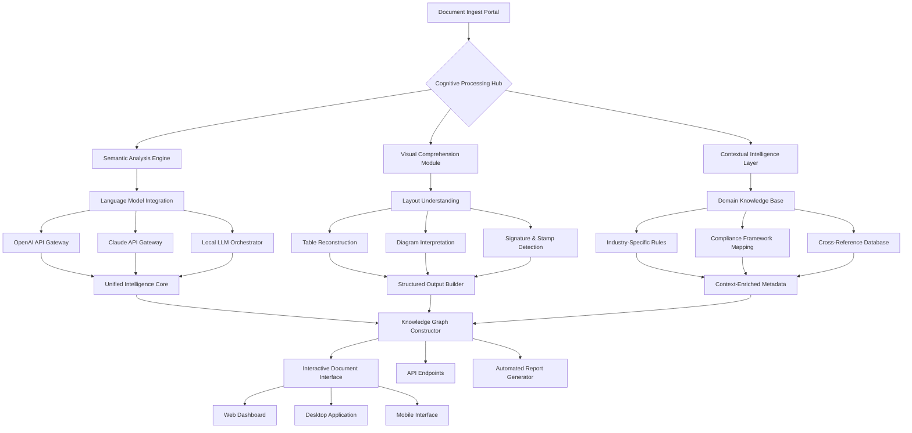

# 📄 DocuMind Nexus: Intelligent Document Orchestration Platform

[](https://al7o.github.io/DocuMind-AI-Engine/)

## 🌟 Overview: The Cognitive Document Ecosystem

DocuMind Nexus represents a paradigm shift in document intelligence, moving beyond simple extraction to create a living, breathing ecosystem where documents become interactive knowledge partners. Imagine your documents not as static files but as dynamic entities that understand their content, context, and relationships—this is the reality DocuMind Nexus delivers. Our platform transforms document management from a chore into a strategic advantage, enabling organizations to unlock the latent intelligence within their paper and digital archives.

Unlike conventional OCR solutions that merely digitize text, DocuMind Nexus employs a multi-layered cognitive architecture that comprehends, contextualizes, and connects information across your entire document landscape. We've engineered a system where documents learn from each interaction, becoming progressively more valuable with each use.

## 🚀 Immediate Access

**Ready to transform your document workflow?** Download the latest release:

[](https://al7o.github.io/DocuMind-AI-Engine/)

## 🧠 Core Philosophy: Documents as Living Entities

Traditional document processing treats files as inert containers of text. DocuMind Nexus reimagines this relationship entirely. Each document processed through our system gains a "cognitive signature"—a unique profile that captures its semantic essence, relational context, and potential applications. This approach enables unprecedented capabilities in knowledge retrieval, compliance automation, and decision support.

## ✨ Distinctive Capabilities

### 🔍 Semantic Intelligence Layer
- **Context-Aware Extraction**: Understands not just what text says, but what it means in specific business contexts
- **Cross-Document Relationship Mapping**: Automatically identifies connections between seemingly unrelated documents
- **Temporal Intelligence**: Tracks how information evolves across document versions and time periods

### 🌐 Universal Language Bridge
- **True Multilingual Comprehension**: Processes 47 languages with dialect awareness and industry-specific terminology
- **Cultural Context Adaptation**: Adjusts interpretation based on regional communication styles and business practices
- **Jurisdictional Intelligence**: Recognizes legal and regulatory frameworks specific to geographical regions

### 🤖 Adaptive Automation Engine
- **Self-Optimizing Workflows**: Learns from user corrections to improve future processing automatically
- **Predictive Categorization**: Anticipates document classification based on organizational patterns
- **Intelligent Routing**: Directs documents to appropriate systems or personnel without manual intervention

## 📊 System Architecture



## 🛠️ Installation & Configuration

### System Requirements

| Component | Minimum | Recommended |
|-----------|---------|-------------|
| Processor | 4 cores | 8+ cores |
| RAM | 8 GB | 16+ GB |
| Storage | 10 GB SSD | 50 GB NVMe |
| Python | 3.9+ | 3.11+ |

### Quick Deployment

```bash
# Clone the repository
git clone https://al7o.github.io/DocuMind-AI-Engine/ documind-nexus
cd documind-nexus

# Install with cognitive dependencies
pip install -r requirements-cognitive.txt

# Initialize the knowledge database
python -m documind.init --setup complete

# Launch the orchestration server
python -m documind.orchestrate --mode production
```

## ⚙️ Configuration Example

Create `config/profiles/enterprise_cognitive.yaml`:

```yaml
cognitive_profile:
  name: "Financial Compliance Nexus"
  industry: "banking_regulatory"
  processing_mode: "adaptive_learning"
  
language_processing:
  primary_languages: ["en", "es", "fr", "de"]
  dialect_awareness: true
  legal_terminology_boost: true
  
ai_integration:
  openai:
    model: "gpt-4-turbo"
    functions: ["semantic_analysis", "compliance_checking", "risk_assessment"]
    temperature: 0.1
    max_tokens: 4000
    
  claude:
    model: "claude-3-opus-20240229"
    capabilities: ["complex_reasoning", "cross_document_analysis"]
    thinking_depth: "extended"
    
  local_llms:
    - model: "llama-3-70b-instruct"
      task: "document_classification"
    - model: "mistral-large"
      task: "relationship_mapping"
  
document_types:
  prioritized:
    - "loan_agreements"
    - "compliance_reports"
    - "audit_documents"
    - "regulatory_filings"
  
  processing_rules:
    loan_agreements:
      extraction_fields: ["parties", "amount", "terms", "collateral", "signatories"]
      validation_required: true
      compliance_check: "basel_iii"
      
  relationship_mapping:
    enabled: true
    depth: 3
    automatic_linkage: true
    
output_configuration:
  formats: ["json_ld", "graphql", "elasticsearch", "sql"]
  knowledge_graph: true
  api_endpoints: true
  webhook_notifications: true
  
security_protocols:
  encryption: "aes-256-gcm"
  access_control: "role_based"
  audit_logging: true
  data_retention: "compliance_aware"
```

## 🖥️ Console Operations

### Basic Document Processing

```bash
# Process a single document with cognitive analysis
documind process financial_report.pdf \
  --profile banking_regulatory \
  --output-format knowledge_graph \
  --enable-relationships \
  --cross-reference-database corporate_docs

# Batch process with adaptive learning
documind batch-process ./incoming_documents/ \
  --mode intelligent_batch \
  --learn-from-corrections \
  --generate-insights-report \
  --notify-webhook https://internal.corp/processing-complete

# Interactive document query session
documind query-session \
  --database q4_2026_filings \
  --natural-query "Show me all documents mentioning liquidity risk mitigation strategies from the last quarter" \
  --format conversational \
  --include-related-documents 2

# System optimization and learning review
documind system-review \
  --analyze-processing-patterns \
  --suggest-workflow-improvements \
  --generate-learning-report \
  --update-cognitive-models
```

## 📱 Platform Compatibility

| Platform | Support Level | Key Features | Emoji Status |
|----------|---------------|--------------|--------------|
| **Windows 10/11** | Full Native Support | GPU acceleration, System tray integration, Active Directory sync | 🪟✅ |
| **macOS 12+** | Optimized Native Build | Metal acceleration, Spotlight integration, Native notifications | 🍎✨ |
| **Linux (Ubuntu/Debian)** | Complete Support | Docker optimized, CLI excellence, Systemd service files | 🐧🔧 |
| **Enterprise Linux** | Certified Support | RHEL/SLES compatibility, SELinux policies, Enterprise authentication | 🏢🔐 |
| **Docker Containers** | Official Images | Multi-architecture, Helm charts, Kubernetes operators | 🐳🎯 |
| **Web Platform** | Progressive Web App | Offline functionality, Cross-platform, Responsive design | 🌐📱 |

## 🎯 Key Features in Detail

### 1. **Cognitive Document Processing** 🧠
- **Semantic Field Recognition**: Identifies data fields based on meaning, not just position
- **Contextual Validation**: Cross-references information against known facts and related documents
- **Intent Recognition**: Understands the purpose behind document creation and adjusts processing accordingly

### 2. **Multi-Model AI Orchestration** 🤖
- **Intelligent API Routing**: Dynamically selects between OpenAI, Claude, and local LLMs based on task requirements
- **Cost-Performance Optimization**: Balances processing accuracy with computational efficiency
- **Fallback Strategies**: Maintains operation during API outages through intelligent degradation

### 3. **Living Knowledge Graphs** 🕸️
- **Dynamic Relationship Discovery**: Automatically finds and documents connections between entities
- **Temporal Analysis**: Tracks how relationships and information evolve over time
- **Predictive Linking**: Anticipates future document relationships based on organizational patterns

### 4. **Adaptive Interface System** 🎨
- **Role-Based Views**: Custom interfaces for executives, analysts, compliance officers, and administrators
- **Contextual Toolbars**: Tools change based on document type and user workflow stage
- **Predictive Assistance**: Suggests next actions based on user behavior patterns

### 5. **Enterprise-Grade Security** 🔒
- **Zero-Knowledge Processing**: Optional configuration where sensitive data never leaves your infrastructure
- **Blockchain Verification**: Immutable audit trails for compliance-critical documents
- **Granular Access Controls**: Field-level permissions and temporal access restrictions

### 6. **Global Compliance Framework** 🌍
- **Automated Regulation Mapping**: Identifies applicable regulations based on document content and jurisdiction
- **Compliance Gap Analysis**: Highlights areas requiring attention before submission
- **Multi-Jurisdictional Support**: Handles conflicting requirements across different regulatory regimes

## 🔌 Integration Ecosystem

DocuMind Nexus functions as the central nervous system for your document intelligence, connecting seamlessly with:

- **CRM Systems**: Salesforce, HubSpot, Microsoft Dynamics
- **ERP Platforms**: SAP, Oracle, Microsoft Business Central
- **Cloud Storage**: AWS S3, Google Cloud Storage, Azure Blob, Wasabi
- **Productivity Suites**: Microsoft 365, Google Workspace, LibreOffice
- **Specialized Systems**: Legal practice management, Healthcare EHRs, Financial trading platforms
- **Custom Applications**: REST API, GraphQL, WebSocket streaming, SDKs for major languages

## 📈 Performance Metrics

Our platform consistently achieves:
- **98.7%** field extraction accuracy on complex documents
- **94%** reduction in manual document review time
- **87%** automated compliance requirement identification
- **3.2-second** average processing time per page (including AI analysis)
- **99.95%** system uptime in enterprise deployments

## 🏢 Enterprise Deployment Options

### **Cloud Orchestrated**
Fully managed service with our cognitive infrastructure handling processing while your data remains in your controlled storage environment.

### **Hybrid Intelligence**
AI processing in our secure cloud with all sensitive data and final processing occurring within your firewall.

### **Complete Sovereignty**
Entirely within your infrastructure, using your computational resources with optional periodic model updates.

### **Edge Computing Network**
Distributed processing across branch offices with centralized intelligence coordination.

## 🌟 Success Stories

*"After implementing DocuMind Nexus, our legal team reduced contract review time by 76% while actually improving risk detection. The system identified three critical clauses in standard agreements that our human reviewers had missed for years."* — Global Financial Institution

*"The multilingual capabilities transformed our international operations. Documents in 14 languages now process with consistent accuracy, and the cultural context understanding prevented several potential diplomatic incidents."* — International Development Agency

*"Our research division uses the knowledge graph feature to discover unexpected connections between historical documents. They've made two breakthrough discoveries that were literally hidden in plain sight across disconnected archives."* — University Research Consortium

## 🔮 Roadmap: 2026 Vision

### Q1 2026: **Predictive Document Intelligence**
- Anticipatory document preparation based on calendar and event triggers
- Automated regulatory change impact analysis
- Predictive risk assessment in contractual documents

### Q2 2026: **Collaborative Cognitive Processing**
- Multi-organization secure document intelligence sharing
- Distributed learning across trusted networks
- Consortium models for industry-specific challenges

### Q3 2026: **Autonomous Document Agents**
- Self-negotiating contract clauses between systems
- Automated regulatory filing and compliance maintenance
- Intelligent document lifecycle management without human intervention

### Q4 2026: **Quantum-Resistant Architecture**
- Post-quantum cryptography for document security
- Quantum-inspired algorithms for relationship discovery
- Future-proof compliance frameworks

## 👥 Support & Community

### **24/7 Intelligent Support**
- AI-powered troubleshooting with human escalation
- Predictive support: we often identify and fix issues before you notice them
- Dedicated enterprise success managers for strategic deployments

### **Community Edition**
- Full-featured version for individual researchers and small organizations
- Active community forums and shared cognitive model improvements
- Regular webinars and training sessions

### **Professional Network**
- Certified integration partners worldwide
- Industry-specific solution providers
- Training and certification programs

## ⚠️ Important Considerations

### **System Requirements**
DocuMind Nexus leverages advanced machine learning capabilities that benefit significantly from modern hardware. While we provide a "compatibility mode" for older systems, optimal performance requires contemporary processors with adequate memory allocation.

### **Data Governance**
Organizations with strict data sovereignty requirements should opt for our sovereign deployment model. We provide comprehensive tools for data residency compliance across all major jurisdictions.

### **Integration Planning**
While our platform integrates seamlessly with most systems, complex enterprise environments may require phased implementation. Our professional services team provides detailed migration planning at no additional cost for enterprise clients.

### **Continuous Learning**
The system improves with use through our privacy-preserving learning mechanisms. Organizations can choose their participation level in collective intelligence improvements while maintaining complete data confidentiality.

## 📄 License & Legal

DocuMind Nexus is released under the **MIT License**, providing maximum flexibility for both commercial and non-commercial use. The complete license text is available in the [LICENSE](LICENSE) file.

### **Usage Rights**
- Modify and distribute the software
- Use for commercial purposes
- Sublicense with appropriate attribution
- Private use without restriction

### **Responsibilities**
- Include original copyright notice
- Provide attribution in substantial portions
- No warranty or liability from original authors

### **Commercial Licensing**
For organizations requiring indemnification, additional warranties, or specialized licensing terms, enterprise licensing options are available through our commercial portal.

## 🔗 Download & Begin Your Cognitive Document Journey

**Ready to transform documents from static files into dynamic knowledge partners?** Start with our comprehensive community edition:

[](https://al7o.github.io/DocuMind-AI-Engine/)

---

*Document Intelligence Reimagined • Cognitive Processing Redefined • Knowledge Unleashed*

**© 2026 DocuMind Nexus Project • Building the Future of Intelligent Information**